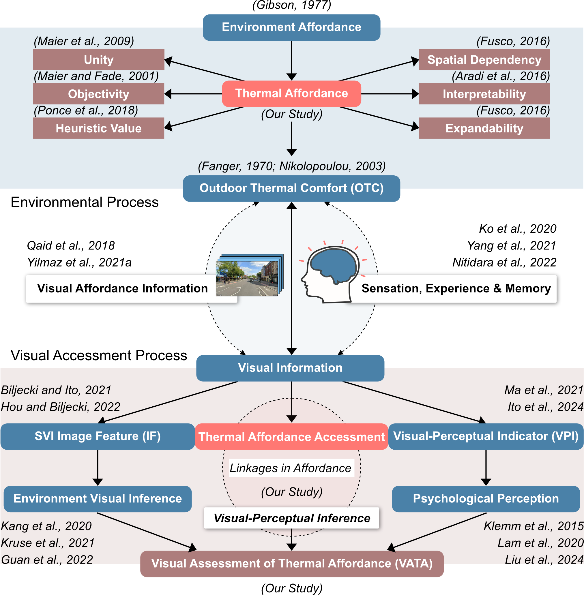
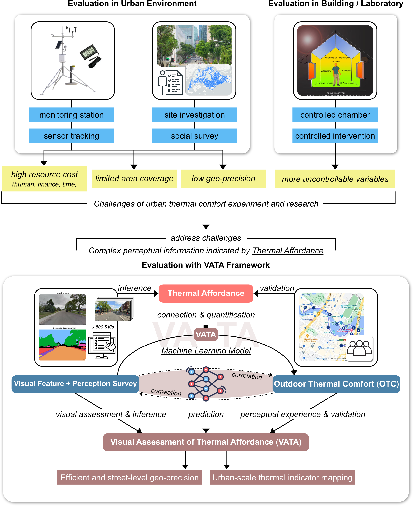
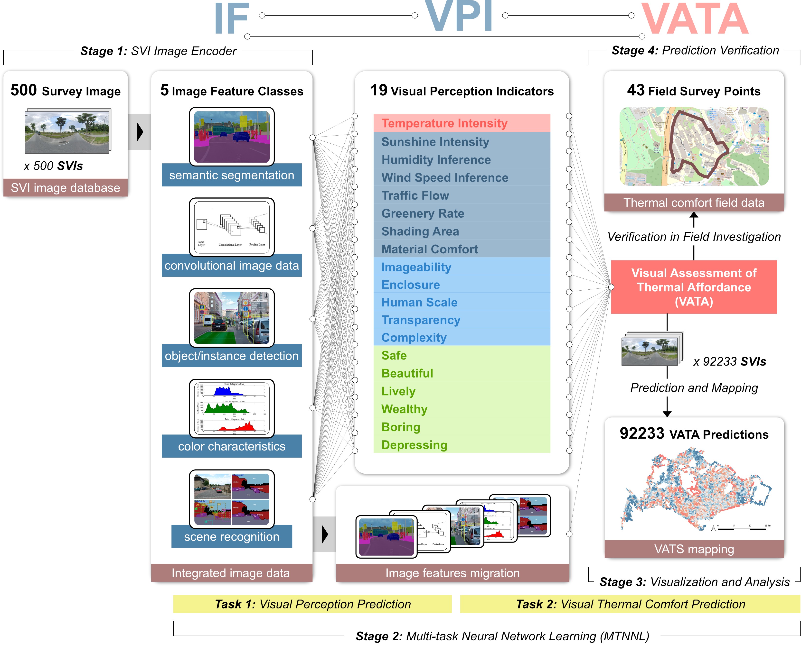
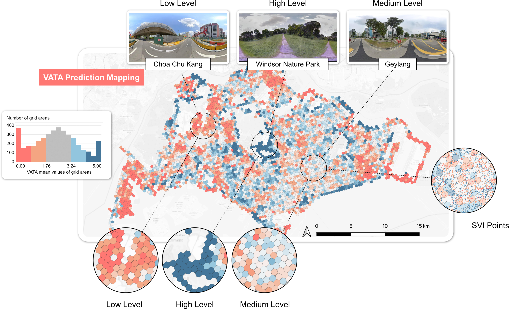
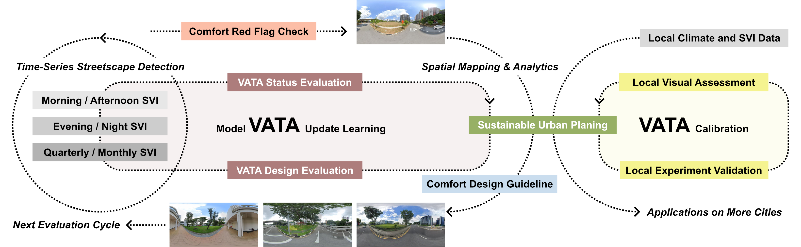

# 
Thermal Comfort in Sight: Thermal Affordance and Its Visual Assessment

**[Sijie Yang](https://sijie-yang.com)**a,b, **[Adrian Chong](https://blog.nus.edu.sg/adrianchong/)**c, **[Pengyuan Liu](https://fcl.ethz.ch/people/researchers/pengyuan-liu.html)**d, **[Filip Biljecki](https://filipbiljecki.com)**a,e,*

a Department of Architecture, National University of Singapore  
b School of Engineering and Applied Science, University of Pennsylvania  
c Department of Built Environment, National University of Singapore  
d Future Cities Lab Global, Singapore-ETH Centre  
e Department of Real Estate, National University of Singapore  
* Corresponding author: filip@nus.edu.sg

<a href="https://ual.sg">Urban Analytics Lab</a> | <a href="https://ideaslab.io">Ideas Lab</a> | <a href="https://sec.ethz.ch">Singapore-ETH Centre</a>

## Introduction: The Challenge of Urban Heat

The intensifying Urban Heat Island (UHI) effect poses significant challenges to cities worldwide. It drives extreme climate changes, increases energy consumption for cooling, and degrades public health by worsening air quality and reducing outdoor thermal comfort (OTC). OTC, defined as one's subjective satisfaction with urban thermal conditions, is critical for urban livability. Poor OTC can lead to heat-related illnesses and even affect mental health.

Traditional methods for evaluating OTC rely on field surveys and environmental measurements, which are often costly, resource-intensive, and limited in spatial scale and precision. While indices like PET, PMV, and UTCI exist, applying them effectively in complex urban environments remains challenging.

Recent advances in using Street View Imagery (SVI) combined with computer vision offer promising avenues for large-scale streetscape analysis. SVI can capture both objective image features (IF) like geometry and greenery, and subjective visual-perceptual indicators (VPI) like comfort and enclosure through surveys. Studies have linked SVI features to thermal environments, but significant research gaps remain.

## Research Gaps and Our Response

### Lack of a Unifying Concept
There's no clear theoretical framework linking the objective properties of the built environment to thermal comfort potential in streetscape design.

**Our Response**: We introduce the concept of Thermal Affordance, inspired by Gibson's theory, to describe the inherent capability of a streetscape's configuration to influence thermal comfort.

### Limited Use of Visual Assessment
Human visual assessment of streetscapes' thermal properties using SVI is understudied, and methods often lack validation with real-world OTC data.

**Our Response**: We propose the Visual Assessment of Thermal Affordance (VATA) framework, integrating SVI-derived IFs and survey-based VPIs to quantify thermal affordance.

### Need for a Systematic Workflow
There's a lack of a robust, replicable workflow integrating multi-source data (SVI, surveys, in-field measurements) for urban-scale OTC evaluation.

**Our Response**: The VATA framework provides a data-driven workflow that integrates these sources, enabling validated prediction and inference models for thermal affordance.

## The Idea of Thermal Affordance

*Figure 1: Conceptual illustration of Thermal Affordance*

Thermal Affordance refers to the inherent capability of an environment (like a streetscape) to impact thermal comfort, integrating various environmental factors. It aims to be:

- **Unified**: Encompassing all relevant fixed environmental variables.
- **Objective**: Focused on environmental properties, not just subjective feelings.
- **Heuristic**: Inspiring understanding and analysis of thermal comfort.
- **Spatially Dependent**: Emphasising differences between environments.
- **Interpretable**: Linking environmental attributes to thermal comfort potential.
- **Expandable**: Allowing incorporation of additional variables over time.

## The VATA Framework

*Figure 2: The VATA Framework for assessing thermal affordance*

The VATA framework addresses the challenges of traditional OTC evaluation. It leverages the connection between visual data (SVI), human perception, and thermal comfort.

### Input Data

- **Image Features (IF)**: Extracted from SVI using computer vision (e.g., semantic segmentation for greenery/buildings, object detection for cars/people, pixel features for colour/texture, scene recognition).
- **Visual-Perceptual Indicators (VPI)**: Gathered through online surveys where participants compare pairs of SVIs based on 19 indicators (e.g., perceived temperature, greenery rate, enclosure, safety, beauty) plus VATA itself.

### Modelling

- A Multi-Task Neural Network Learning (MTNNL) model predicts VATA scores. It uses a two-stage approach: IFs predict VPIs, and then IFs + VPIs predict VATA.
- An Elastic Net Regression Model (ENRM) is used for inference, revealing the interpretable relationships between specific IFs, VPIs, and the final VATA score.

### Validation

VATA predictions are validated against real-world OTC data collected through field surveys (thermal walks) using metrics like subjective comfort ratings and physiological data (e.g., heart rate).

## Methodology Summary

*Figure 3: Research framework and methodology*

- **Study Area**: Singapore (chosen for its diverse urban forms and consistent tropical climate).
- **SVI Survey**: 500 representative SVIs (selected via k-means clustering of 92,233 images) were evaluated by 176 participants in an online survey. Participants made pairwise comparisons for VATA and 19 VPIs. TrueSkill algorithm converted comparisons into scores (0-5 scale).
- **IF Extraction**: 5 categories of IFs (52 sub-features total) were extracted from SVIs using models like DeepLabV3+, ResNet-50, and Faster R-CNN.
- **Model Training**: MTNNL trained on IFs and VPI scores (60% train, 20% validation, 20% test split).
- **Inference Modelling**: ENRM trained to understand feature weights and relationships.
- **Validation**: Compared predicted VATA scores for 43 locations with OTC data (comfort ratings, heart rate, solar intensity, noise, altitude) collected during thermal walks at NUS.

## Key Results

### Prediction Model Performance
The MTNNL model achieved superior performance (Adjusted R² = 0.7316) compared to other machine learning models, demonstrating the effectiveness of the two-stage (IF -> VPI -> VATA) approach.

### Validation Against OTC Data
- Smoothed VATA scores showed a strong correlation with surveyed comfort ratings along the thermal walk path (Adjusted R² up to 0.75 using a moderate smoothing factor).
- A multivariate model combining VATA with physiological/environmental data (Heart rate, Solar intensity, Noise, Altitude - HSNA) explained significantly more variance in comfort (Adjusted R² = 0.889) than using IFs + HSNA (Adjusted R² = 0.778) or HSNA alone (Adjusted R² = 0.596).

### VATA Mapping

*Figure 10: High-resolution VATA map of Singapore*

We generated a high-resolution map of VATA across Singapore, aggregated into hexagonal units. This map visually identifies areas with high (e.g., parks like Windsor Nature Park, East Coast Park) and low (e.g., parts of Choa Chu Kang) thermal affordance, guiding potential interventions.

### Inference Model Insights
The ENRM model (Adjusted R² = 0.744) revealed key factors:

**Positive Contributors to VATA**:
- Vegetation
- Terrain
- Sky proportion
- Shading area
- Human-scale design elements
- Perceived humidity/wind
- Perceived beauty/safety

**Negative Contributors to VATA**:
- Traffic elements
- Complex/construction scenes
- High pixel detail/contrast
- Perceived temperature/sunlight intensity
- Perceived traffic flow/complexity/boredom

## Discussion & Significance

*Figure 13: Discussion of the VATA framework's significance and applications*

The VATA framework provides a scalable, cost-effective, and validated method for assessing urban thermal affordance.

### Urban Planning Tool
High-resolution VATA maps help planners identify areas needing improvement and prioritise interventions like adding greenery or shading.

### Design Guidance
Inference models reveal which specific streetscape features (IFs) and perceptual qualities (VPIs) most influence thermal affordance, informing evidence-based design decisions.

### Continuous Monitoring
The framework supports a continuous monitoring cycle, using updated SVI data to refine models and track the impact of interventions over time.

### Transferability
While developed for Singapore, the methodology can be adapted to other cities by conducting local surveys and validations.

## Limitations and Future Directions

1. **Temporal Variance**: Did not account for time-of-day, weather, or seasonal changes in SVI.
2. **Validation Scope**: Validation was limited to one path; broader validation across diverse locations and microclimates is needed.
3. **Data Sources**: Could be enhanced by integrating satellite imagery, LST data, or detailed microclimate simulations.
4. **Survey Limitations**: Online surveys have inherent limitations; incorporating expert assessments could be beneficial.
5. **Cross-City Validation**: Testing the framework in different climatic and urban contexts is crucial.

## Conclusion

This research introduces the novel concept of thermal affordance and the VATA framework for its assessment. By integrating SVI, human perception surveys, machine learning, and field validation, VATA offers a powerful tool to evaluate and improve thermal comfort in urban streetscapes. It provides actionable insights for sustainable urban planning and design, contributing to the creation of more liveable and resilient cities.

## License

This work is licensed under a [Creative Commons Attribution 4.0 International License](https://creativecommons.org/licenses/by/4.0/).

This means you are free to:
- Share — copy and redistribute the material in any medium or format
- Adapt — remix, transform, and build upon the material for any purpose, even commercially

Under the following terms:
- Attribution — You must give appropriate credit, provide a link to the license, and indicate if changes were made. You may do so in any reasonable manner, but not in any way that suggests the licensor endorses you or your use.
